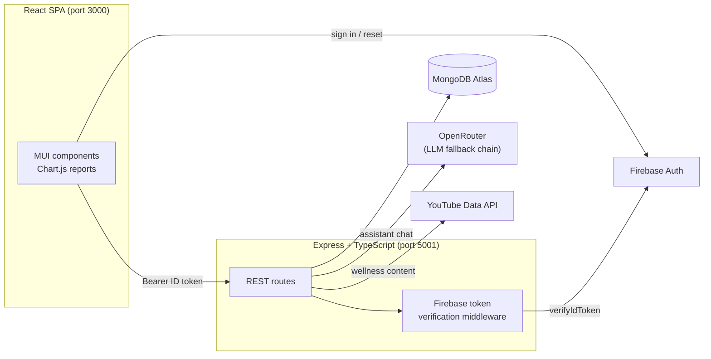

<div align="center">

# 🧞 Migraine Genie

**A migraine tracking and pattern-discovery app — log your symptoms, spot your triggers, and understand your headaches.**

### 🌐 [migraine-genie.com](https://migraine-genie.com)

[](https://react.dev/)
[](https://www.typescriptlang.org/)
[](https://expressjs.com/)
[](https://www.mongodb.com/atlas)
[](https://firebase.google.com/)
[](https://mui.com/)

</div>

---

## What it does

Migraine sufferers are often told "keep a diary" and then left to find the patterns themselves. Migraine Genie does that part for you.

You log a day — intensity, duration, sleep, screen time, triggers, and 25 tracked symptoms — and the app turns weeks of entries into charts, a severity heatmap, and a ranked list of what most often precedes your migraines. An AI assistant grounded in *your own logged data* answers questions about your patterns.

### Features

| | |
|---|---|
| 📝 **Migraine diary** | Intensity, duration, sleep, screen time, notes, plus 25 symptoms scored No → Severe |
| 🎯 **Trigger tracking** | Icon-based pickers across four categories — general, weather, food, and activity |
| 📊 **Visual reports** | Frequency and duration by intensity, daily duration over time, most frequent triggers, Top 3 triggers and symptoms |
| 🗓️ **Severity heatmap** | Month calendar shaded by total symptom severity; click any day to read its entries |
| 🤖 **AI assistant** | "Migraine Genie" chat, scoped strictly to migraine topics and grounded in your logged history |
| 🔮 **Trigger prediction** | Unlocks once you have logged 10+ entries |
| 💊 **Medication log** | Track what you take and when |
| 🧘 **Wellness content** | Curated relief and prevention videos |
| 🔐 **Accounts** | Firebase email/password and Google sign-in, password reset, full account deletion |

---

## Screenshots

> 📸 _Screenshots pending — drop your images into `docs/screenshots/` and uncomment the block below._

<!--
| Dashboard | Diary entry |
|---|---|
|  |  |

| Visual report | AI assistant |
|---|---|
|  |  |
-->

---

## Architecture



**How auth works:** the client signs in through Firebase and attaches a fresh Firebase ID token to every request via an Axios interceptor. The server verifies that token with the Firebase Admin SDK and resolves it to a MongoDB user record — the client never supplies its own user id, so entries can't be read or written across accounts.

---

## Tech stack

| Layer | Technology |
|---|---|
| Frontend | React 19, TypeScript, MUI 6, Chart.js / react-chartjs-2, React Router 7, Framer Motion, dayjs |
| Backend | Node.js, Express 4, TypeScript, Mongoose 8 |
| Database | MongoDB Atlas |
| Auth | Firebase Authentication (email/password + Google), Firebase Admin SDK |
| AI | OpenRouter, with a nine-model fallback chain |
| Integrations | YouTube Data API (wellness content), Nodemailer |

---

## Project structure

```
Migraine-Genie/
├── client/                 # React SPA (Create React App + TypeScript)
│   └── src/
│       ├── components/     # DailyLog, Visualization, AIAssistant, Medication, …
│       ├── pages/          # Dashboard, Account, Home, VerifyEmail
│       ├── services/       # Axios client, Firebase init
│       └── utils/          # Timezone-safe date helpers
├── server/                 # Express REST API (TypeScript)
│   └── src/
│       ├── controllers/    # Request handling and business logic
│       ├── models/         # Mongoose schemas
│       ├── routes/         # Route definitions
│       ├── middleware/     # Firebase token verification
│       └── services/       # Firebase Admin, mailer, YouTube
├── python/                 # Offline sandbox for tuning AI prompts
└── DEPLOYMENT.md           # Render + custom domain checklist
```

---

## Getting started

### Prerequisites

- [Node.js](https://nodejs.org/) 18+ and npm
- A [MongoDB Atlas](https://www.mongodb.com/atlas/database) cluster (or local MongoDB)
- A [Firebase](https://firebase.google.com/) project with Authentication enabled
- An [OpenRouter](https://openrouter.ai/) API key (for the AI assistant)

### 1. Clone and install

```bash
git clone https://github.com/TaraTony/Migraine-Genie.git
```

```bash
cd Migraine-Genie/server && npm install && cd ../client && npm install
```

### 2. Configure the server

Create `server/.env`:

```bash
MONGO_URI=mongodb+srv://<user>:<password>@<cluster>.mongodb.net/<db>
PORT=5001

# Firebase Admin — either the raw service-account JSON on one line,
# base64-encoded JSON, or a path to the .json file
FIREBASE_SERVICE_ACCOUNT_JSON={"type":"service_account", ...}
# FIREBASE_SERVICE_ACCOUNT_PATH=./serviceAccount.json

# AI assistant
OPENROUTER_API_KEY=sk-or-...
OPENROUTER_SITE_URL=http://localhost:3000
OPENROUTER_APP_NAME=Migraine Genie

# Optional integrations
YOUTUBE_API_KEY=
SMTP_USER=
SMTP_PASS=
MAIL_FROM=
```

### 3. Configure the client

Create `client/.env`:

```bash
REACT_APP_API_BASE=http://localhost:5001
```

Brand and SEO metadata is centralized in `client/src/config/site.ts`.

Firebase web config lives in `client/src/services/firebase.ts` — point it at your own project.

### 4. Run both services

```bash
cd server && npm run dev
```

```bash
cd client && npm start
```

The API listens on **http://localhost:5001** and the app opens at **http://localhost:3000**.

### Production build

```bash
cd server && npm run build && npm start
```

```bash
cd client && npm run build
```

---

## API reference

All routes below require an `Authorization: Bearer <firebase-id-token>` header unless marked public.

### Users — `/api/users`

| Method | Endpoint | Description |
|---|---|---|
| `POST` | `/sync` | Create or fetch the Mongo profile for the signed-in Firebase user |
| `GET` | `/me` | Profile plus stats: join date, total entries, most recent intensity |
| `PUT` | `/update` | Update name, date of birth, gender |
| `DELETE` | `/me` | Delete the account, all health records, and the Firebase user |

### Diary — `/api/daily-inputs`

| Method | Endpoint | Description |
|---|---|---|
| `GET` | `/` | All entries for the signed-in user, newest first |
| `GET` | `/my/count` | Entry count and whether prediction is unlocked (10+ entries) |
| `POST` | `/` | Create an entry |
| `PUT` | `/:id` | Update an entry |
| `DELETE` | `/:id` | Delete an entry |

### Other

| Method | Endpoint | Description |
|---|---|---|
| `POST` | `/api/assistant/doctor-chat` | AI chat grounded in the user's logged history |
| `GET` | `/api/predictions/generate` | Generate a trigger prediction |
| `GET` / `POST` | `/api/medications` | List and create medication records |
| `GET` | `/api/wellness/content` | Curated wellness videos |
| `GET` | `/api/symptoms`, `/api/triggers` | Reference data |

---

## Implementation notes

**Dates are timezone-safe.** Diary dates are calendar days, not instants. The client sends the picked day anchored to UTC, the server normalizes it to UTC midnight, and the UI reads the calendar day straight off the stored value rather than converting through the browser's timezone — so an entry logged on the 9th always reads as the 9th, wherever it is opened.

**The AI is scoped and guarded.** The assistant's system prompt restricts it to migraine and headache topics, forbids formal diagnosis, and escalates red-flag symptoms toward real medical care. Requests walk a fallback chain of nine models so a single provider outage doesn't take the feature down.

**One entry per day per user** is enforced by a compound unique index on `{ user_id, log_date }`.

**SEO is route-aware.** As a single-page app, the static tags in `index.html` only describe the first page loaded. A `<Seo />` component syncs title, description, canonical URL, and Open Graph tags to the current route — and marks every signed-in screen `noindex, nofollow` so personal health pages stay out of search results.

---

## Deployment

See **[DEPLOYMENT.md](DEPLOYMENT.md)** for the full Render + custom-domain checklist, including the Firebase authorized-domains step that is easy to miss.

---

## Roadmap

- [ ] Per-user rate limiting and spend caps on the AI assistant before public launch
- [ ] Export diary history to PDF/CSV for appointments
- [ ] Native mobile builds (Capacitor) for the App Store and Play Store
- [ ] Automated test coverage

---

## ⚕️ Medical disclaimer

Migraine Genie is a self-tracking tool, **not a medical device**. It does not diagnose, treat, or cure any condition, and its AI assistant is not a substitute for a qualified healthcare professional. Seek urgent medical care for a sudden "worst ever" headache, neurological symptoms, fever with neck stiffness, or a head injury.

## License

No license file yet — add one (MIT is a good default for a portfolio project) to make the terms of reuse explicit.
